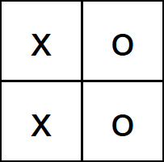

Given a 2-D grid of characters `board` and a list of strings `words`, return all words that are present in the grid.

For a word to be present it must be possible to form the word with a path in the board with horizontally or vertically neighboring cells. The same cell may not be used more than once in a word.

---

## Examples

**Example 1**


Input:

```
board = [
  ["a","b","c","d"],
  ["s","a","a","t"],
  ["a","c","k","e"],
  ["a","c","d","n"]
],
words = ["bat","cat","back","backend","stack"]
```

Output: `["cat","back","backend"]`

---

**Example 2**



Input:

```
board = [
  ["x","o"],
  ["x","o"]
],
words = ["xoxo"]
```

Output: `[]`

---

## Solution

### Java Code

```java
import java.util.*;

class Solution {
    class TrieNode {
        TrieNode[] children = new TrieNode[26];
        String word = null; // Store the word at the leaf node for easy retrieval
    }

    public List<String> findWords(char[][] board, String[] words) {
        List<String> result = new ArrayList<>();
        TrieNode root = buildTrie(words);

        for (int i = 0; i < board.length; i++) {
            for (int j = 0; j < board[0].length; j++) {
                dfs(board, i, j, root, result);
            }
        }

        return result;
    }

    private void dfs(char[][] board, int r, int c, TrieNode node, List<String> result) {
        char ch = board[r][c];
        if (ch == '#' || node.children[ch - 'a'] == null) {
            return;
        }

        node = node.children[ch - 'a'];
        if (node.word != null) {
            result.add(node.word);
            node.word = null; // Avoid duplicate entries
        }

        board[r][c] = '#'; // Mark as visited

        int[][] dirs = {{0, 1}, {0, -1}, {1, 0}, {-1, 0}};
        for (int[] dir : dirs) {
            int nr = r + dir[0];
            int nc = c + dir[1];
            if (nr >= 0 && nr < board.length && nc >= 0 && nc < board[0].length) {
                dfs(board, nr, nc, node, result);
            }
        }

        board[r][c] = ch; // Backtrack
    }

    private TrieNode buildTrie(String[] words) {
        TrieNode root = new TrieNode();
        for (String w : words) {
            TrieNode current = root;
            for (char ch : w.toCharArray()) {
                int index = ch - 'a';
                if (current.children[index] == null) {
                    current.children[index] = new TrieNode();
                }
                current = current.children[index];
            }
            current.word = w;
        }
        return root;
    }
}
```

---

## Intuition

The naive approach is to perform a standard "Word Search" (DFS) for every word in the list. However, with up to 30,000 words, this would be highly inefficient.

Instead, we can use a **Trie (Prefix Tree)** to store all target words. This allows us to search for multiple words simultaneously as we traverse the board.

### Why Trie?
- As we move on the board, the Trie tells us if our current path is a prefix of any valid word.
- If the current path is NOT in the Trie, we can **prune** the search immediately.
- If we hit a node marked as an "end of word", we've found one!

### Backtracking
- We use DFS to explore paths.
- To avoid using the same cell twice in one path, we temporarily mark it with a placeholder (e.g., `#`).
- After exploring all directions from that cell, we restore its original value (**Backtracking**).

---

## Complexity Analysis

### Time Complexity

$O(R \times C \times 4^L)$

- $R, C$ are board dimensions.
- $L$ is the maximum word length.
- In the worst case, we explore 4 directions at each step for a depth of $L$.

### Space Complexity

$O(N \times L)$

- To store the Trie where $N$ is the number of words and $L$ is the average length.

---

## Key Takeaways

- **Trie + DFS** is a powerful combination for searching multiple strings in a grid.
- **Pruning** the search space using the Trie significantly improves performance.
- Storing the actual `word` string inside the leaf node of the Trie makes it easy to add results without extra string manipulation.
