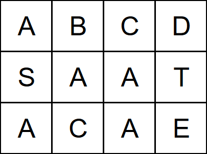

Given a 2-D grid of characters `board` and a string `word`, return `true` if the word is present in the grid, otherwise return `false`.

For the word to be present it must be possible to form it with a path in the board with horizontally or vertically neighboring cells. The same cell may not be used more than once in a word.

---

## Examples

**Example 1**


Input: 
```text
board = [
  ["A","B","C","D"],
  ["S","A","A","T"],
  ["A","C","A","E"]
],
word = "CAT"
```

Output: `true`

**Example 2**



Input: 
```text
board = [
  ["A","B","C","D"],
  ["S","A","A","T"],
  ["A","C","A","E"]
],
word = "BAT"
```

Output: `false`

---

## Solution

### Java Code

```java
class Solution {
    public boolean exist(char[][] board, String word) {
        int m = board.length;
        int n = board[0].length;

        for (int r = 0; r < m; r++) {
            for (int c = 0; c < n; c++) {
                // Start DFS if the first character matches
                if (board[r][c] == word.charAt(0)) {
                    if (dfs(board, word, r, c, 0)) {
                        return true;
                    }
                }
            }
        }

        return false;
    }

    private boolean dfs(char[][] board, String word, int r, int c, int index) {
        // Base case: all characters in the word have been found
        if (index == word.length()) {
            return true;
        }

        // Boundary and character match check
        if (r < 0 || r >= board.length || 
            c < 0 || c >= board[0].length || 
            board[r][c] != word.charAt(index)) {
            return false;
        }

        // Mark the current cell as visited (backtracking)
        char temp = board[r][c];
        board[r][c] = '#';

        // Explore neighbors: up, down, left, right
        boolean found = dfs(board, word, r + 1, c, index + 1) ||
                        dfs(board, word, r - 1, c, index + 1) ||
                        dfs(board, word, r, c + 1, index + 1) ||
                        dfs(board, word, r, c - 1, index + 1);

        // Restore the character (backtracking)
        board[r][c] = temp;

        return found;
    }
}
```

---

## Intuition

The problem is a search problem on a 2D grid where we need to find if a sequence of characters exists. This is naturally solved using **Depth-First Search (DFS)** with **Backtracking**.

### Search Process
1.  **Iterate**: Loop through every cell in the grid. If a cell matches the first character of the word, begin a DFS starting from that cell.
2.  **DFS (Recursive)**:
    - At each cell, check if the current character matches the word's character at the target `index`.
    - To prevent reusing the same cell, temporarily "mask" the cell (e.g., change its value to `#`).
    - Recurse into all 4 adjacent directions (up, down, left, right) for the `index + 1`.
3.  **Backtrack**: After exploring the neighbors, "unmask" the cell by restoring its original character. This allows the cell to be used in other potential paths from different starting points.

---

## Complexity Analysis

### Time Complexity

$O(M \cdot N \cdot 4^L)$

- $M \cdot N$ is the number of cells in the grid.
- $4^L$ represents the exponential search space for a word of length $L$, as we have 4 directions at each step. (In practice, it's $3^L$ after the first step since we don't go back to the parent).

### Space Complexity

$O(L)$

- The maximum depth of the recursion stack is equal to the length of the word $L$.

---

## Key Takeaways

- "Marking" a cell in-place (e.g., `board[r][c] = '#'`) is a common trick to save space compared to using a separate `visited` array.
- In-place marking MUST be followed by restoring the value (backtracking) to ensure other search branches are not affected.
- Pruning (like checking boundary conditions early) is essential for efficient backtracking.
